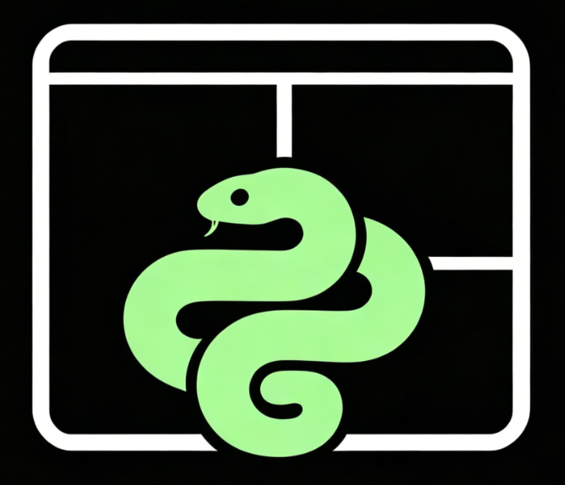
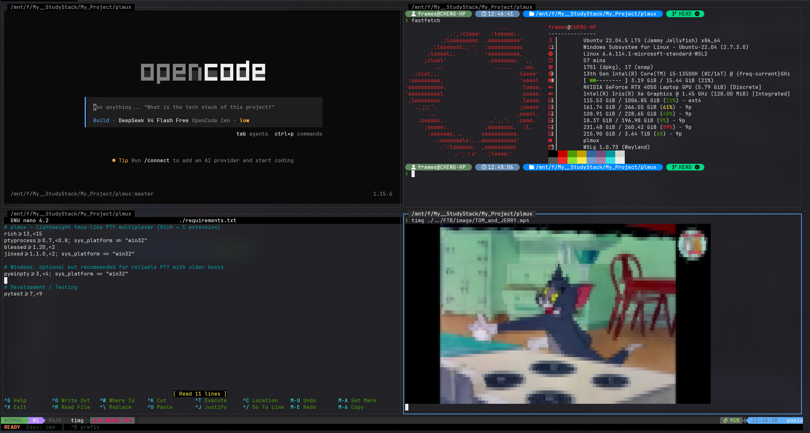

<div align="center">
  

# plmux ： Python Lightweight Terminal Multiplexer 

</div>

[](https://opensource.org/licenses/MIT)
[](https://www.python.org/downloads/)
[](https://github.com/Frames/plmux)

A lightweight, cross-platform terminal multiplexer inspired by tmux, built with Python, Rich, and C extensions. It provides pane splitting, window management, copy mode, a vim-style command interface, dynamic status bar with foreground process display, 23 built-in themes, session persistence, a browser-based web client, and a tmux-like plugin extension system.

<div align="center">
  
  <p>plmux operation in windows terminal(wsl2)</p>
</div>

## Features

- **Pane Splitting**: Vertical and horizontal splits with adjustable ratios
- **Window Management**: Multiple windows with layout cycling
- **Zoom**: Toggle any pane to fullscreen and back
- **Layout Templates**: 10 built-in layout templates (even-horizontal, main-vertical, quad, columns, etc.)
- **Copy Mode**: Text selection and clipboard integration
- **Command Line**: Vim-style `:` command interface with tab completion
- **Dynamic Status Bar**: Real-time display of mode, window, pane, foreground command (nano, btop, fzf, etc.), clock, and hostname
- **Themes**: 23 built-in themes (dracula, gruvbox, tokyonight, catppuccin, nord, and more) + user-defined JSON themes
- **Web Client**: Browser-based terminal access via WebSocket with C extension acceleration
- **Plugin System**: tmux-like extension hooks, custom commands, key bindings, and status items
- **C Extensions**: FastScreen (ANSI parsing/rendering) and WebSocket kernel for high-performance frame processing
- **Cross-Platform**: Works on Windows, macOS, and Linux
- **Session Persistence**: Auto-save and restore layouts
- **Daemon Mode**: Detach and reattach sessions in the background

## Quick Start

### Installation

```bash
pip install .
```

Or install in development mode:

```bash
pip install -e .
```

### Usage

```bash
plmux                  # Start a new session
plmux ls               # List active sessions
plmux lsw              # List windows
plmux lsw -p           # List windows with pane details
plmux attach           # Attach to an existing session
plmux new-session      # Create a detached session
plmux kill-server      # Kill the running daemon
```

## Key Bindings

### Prefix

All key bindings are prefixed by **Ctrl+B** (configurable).

| Action | Binding |
|--------|---------|
| Prefix | `Ctrl+B` |
| Vertical split | Prefix + `%` or `v` |
| Horizontal split | Prefix + `"` or `s` |
| Focus with hjkl | Prefix + `h` `j` `k` `l` |
| Focus with arrows | Prefix + `←` `↓` `↑` `→` |
| Only this pane | Prefix + `o` |
| Zoom pane | Prefix + `z` |
| New window | Prefix + `c` |
| Next/prev window | Prefix + `n` / `p` |
| Goto window 0-9 | Prefix + `0`-`9` |
| Cycle layout | Prefix + `Space` |
| Enter copy mode | Prefix + `[` |
| Resize pane | Prefix + `H` `J` `K` `L` |
| Show help | Prefix + `?` |
| Detach session | Prefix + `d` |
| Close window | Prefix + `&` |
| Force quit | `Ctrl+Q` |

### Copy Mode

See [Copy Mode](docs/copy_mode.en.md) for full documentation.

### Command Line

Press `Esc` then `:` to enter command mode.

| Command | Description |
|---------|-------------|
| `:exit` | Hard quit (clear all saved state) |
| `:split`, `:sp` | Horizontal split |
| `:vsplit`, `:vsp`, `:vs` | Vertical split |
| `:only` | Keep only current pane |
| `:focus <n>` | Focus pane by index |
| `:theme <name>` | Change theme |
| `:theme list` | Open theme browser |
| `:layout` | Open layout browser |
| `:layout <name>` | Apply named layout template |
| `:web [port]` | Start web client (default port 9888) |
| `:webstop` | Stop web client server |
| `:ls` | Open session browser |
| `:plugins` | Open plugin manager |
| `:help` | Show help overlay |

Use `Tab` for command completion.

## Web Client

plmux includes a built-in web server that allows browser-based terminal access. See [Web Client](docs/web-client.md) for full documentation.

```bash
:web              # Start on default port 9888
:web 8080         # Start on custom port
:webstop          # Stop the server
```

Then open `http://localhost:9888` in your browser.

## Configuration

See [Configuration](docs/configuration.md) for full documentation.

## Themes

See [Themes](docs/themes.md) for full documentation.

## Plugins

See [Plugins](docs/plugins.md) for full documentation.

## Architecture

plmux uses C extensions for performance-critical paths:

- **FastScreen** (`plmux/terminal/_c_extension/`): ANSI parsing, screen state management, and rendering — falls back to a pure-Python pyte backend when unavailable
- **WebSocket Kernel** (`plmux/web/_c_extension/`): Frame parsing and encoding for browser terminal — falls back to pure-Python WebSocket when unavailable

Both extensions are optional; plmux works without them using Python fallbacks.

## License

MIT
